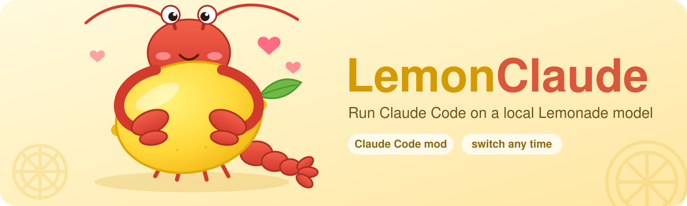

<p align="center">
  
</p>

# LemonClaude 🍋

Run Claude Code on a local model. LemonClaude is a Claude Code mod that adds a [Lemonade](https://github.com/lemonade-sdk/lemonade) model to Claude Code's model selector. Pick 🍋 and requests go to the model on your machine. Pick a Claude model and they go back to Claude. You don't need to restart.

- **One model selector.** In the terminal, Lemonade appears next to Opus, Sonnet and Haiku, and `/model <id>` works too. In the desktop app, `/lemonade on` switches instead.
- **Switch mid-session.** The conversation carries on. Only where the next request goes changes.
- **Subagents follow.** While 🍋 is selected, every request goes to Lemonade, subagents included.
- **Starts Lemonade for you.** On Windows, picking 🍋 starts Lemonade Server if it isn't running.
- **Nothing is left behind.** The environment is restored when you pick Claude again and when the session ends.

## Requirements

| | Version |
| --- | --- |
| [Claude Code](https://claude.com/claude-code) | 2.1.287 or later (the mod API is early access) |
| [Lemonade Server](https://github.com/lemonade-sdk/lemonade) | 2026.40.0 or later, which serves the Anthropic-compatible `/v1/messages` |
| A downloaded chat model | For Claude Code's tools to work, pick one Lemonade labels `tool-calling` |

LemonClaude was developed on Windows 11. Apart from starting Lemonade Server, which is Windows only, it runs entirely inside Claude Code, so it should work anywhere Claude Code and Lemonade run.

## Install

Clone the repository:

```bash
git clone https://github.com/adamczhang/LemonClaude.git
```

Load it for one session:

```bash
claude --plugin-dir /path/to/LemonClaude
```

To load it in every session, the desktop app included, add it to the `env` block of `~/.claude/settings.json`:

```json
"env": { "CLAUDE_CODE_PLUGIN_DIRS": "/path/to/LemonClaude" }
```

On Windows, escape the backslashes, as in `"D:\\Projects\\LemonClaude"`.

## Use

First, download a chat model with Lemonade, for example with `lemonade pull`. On Windows, LemonClaude starts Lemonade Server when it needs it. Elsewhere, start it yourself.

### In the terminal

1. Start `claude`. The model selector (`/model`) now shows an entry such as `🍋 Qwen3.5-4B-GGUF · Local via Lemonade`.
2. Pick it. The status line shows `🍋 <model> (Lemonade)` while requests go to Lemonade.
3. To go back, pick any Claude model.

### In the desktop app

The desktop app's model picker lists only Claude models, so the 🍋 entry doesn't appear there. Use LemonClaude's model manager or its commands instead:

1. Type `/lemonade` to open the model manager (below) and press **Use** on a model. Or type `/lemonade on` to use the offered model. Every request now goes to Lemonade, subagents included, and the status line shows `🍋 <model> (Lemonade)`. The picker keeps showing the Claude model it had.
2. Press **Back to Claude**, type `/lemonade off`, or pick any model in the model picker to go back.

These work in the terminal too.

### The model manager

Bare `/lemonade` draws a model list in the transcript, laid out like the Model Manager in Lemonade's own app:

- **Search** box and a **Downloaded only** switch.
- **Active models:** the models Lemonade has loaded in memory, marked with a green dot.
- **Suggested models:** every chat model Lemonade lists, grouped by recipe as Lemonade groups them (Llama.cpp GPU, Ryzen AI LLM, …). Press a group to open it. Each row shows the model's size and tags such as `tools`, `vision` and `reasoning`.
- **Use** switches requests to a downloaded model, as `/lemonade on <model>` does. A failed download says why, with a **Retry download** button.
- **Download** asks Lemonade to download a model. Lemonade runs the download itself, so it keeps going if you close the session, and the row shows its progress. When it finishes, the row offers **Use**.

The list shows only chat models, the ones Claude Code can talk to. Lemonade's speech, image, music and embedding models stay in Lemonade's app.

### Commands

Claude Code allows only one custom entry in the selector. LemonClaude offers the model you chose last time. The first time, it offers the first downloaded model that supports tool calling.

| Command | What it does |
| --- | --- |
| `/lemonade on` | Sends every request to the offered Lemonade model, whatever the model selector shows, until `/lemonade off` or you pick another model |
| `/lemonade on <model>` | Offers that model and switches to it |
| `/lemonade off` | Requests follow the model selector again |
| `/lemonade` | Opens the model manager: every Lemonade chat model, to use or download |
| `/lemonade <model>` | Offers that model. It takes the exact id or any unique part of it, such as `/lemonade qwen` |
| `/lemonade list` | Lists the models, what the selector offers, and where requests go now |

If requests already go to Lemonade, changing the model moves them to the new one at once.

### When Lemonade isn't running

The entry still appears, offering the model from last time.

- **On Windows**, its description says Lemonade starts when picked. When a request is about to go to Lemonade and the server doesn't answer, LemonClaude starts it, the way the Start menu shortcut does, and waits up to 60 seconds for it. A toast says "Starting Lemonade Server…". Then the request goes ahead. `/lemonade`, `/lemonade on` and `/lemonade <model>` start it too, but `/lemonade list` and `/lemonade off` don't. The server keeps running after the session ends.
- **Elsewhere**, or when Lemonade Server isn't installed in the usual place, the description says to start Lemonade first. Start it before picking the entry.

Either way, if Lemonade still doesn't answer, a toast says so and suggests picking a Claude model.

## Configuration

| Environment variable | Default | Purpose |
| --- | --- | --- |
| `LEMONADE_BASE_URL` | `http://127.0.0.1:13305` | Where Lemonade Server listens |
| `LEMONCLAUDE_LEMONADE_MODEL` | `Qwen3.5-4B-GGUF` | The model to offer while Lemonade is down and no earlier choice is remembered |
| `LEMONCLAUDE_AUTOSTART` | on | Set to `0` so LemonClaude never starts Lemonade Server |
| `ANTHROPIC_CUSTOM_MODEL_OPTION` | — | If you've set this yourself for something other than Lemonade, LemonClaude leaves your entry alone |

## How it works

- **The selector entry** comes from Claude Code's `ANTHROPIC_CUSTOM_MODEL_OPTION`, `_NAME` and `_DESCRIPTION` variables. LemonClaude sets them when the session starts.
- **Routing** happens in a `turn.step` hook, which reads the session's selected model before each request. While `/lemonade on` holds, the hook treats the offered Lemonade model as selected.
  - **Lemonade model selected:** the hook saves the original values, then points `ANTHROPIC_BASE_URL` at Lemonade and sets `CLAUDE_CODE_DISABLE_NONESSENTIAL_TRAFFIC`. Claude Code reads both on every request, and each request names the Lemonade model.
  - **Claude model selected:** the hook restores the saved values.
- **Starting Lemonade:** before each request to Lemonade, the hook checks the server's `/api/v1/health`. If the server doesn't answer, the hook runs `LemonadeServer.exe --silent` from `%LOCALAPPDATA%\lemonade_server\bin` through PowerShell's `Start-Process`. That detaches the server from Claude Code, so it outlives the session. LemonClaude only does this when `LEMONADE_BASE_URL` points at this machine. Requests that find the server down at the same time share one start.
- **Session end:** the environment is also restored when the session ends, including on `/clear`.
- **Model aliases:** unlike `lemonade launch claude`, LemonClaude leaves the `ANTHROPIC_DEFAULT_*_MODEL` aliases alone. Pointing them at Lemonade would make picking Opus resolve to the Lemonade model.

## Known limitations

- **Desktop model picker:** the desktop app's picker lists only Claude models and doesn't show the 🍋 entry. Use `/lemonade` or `/lemonade on`. While requests go to Lemonade, the picker still names a Claude model.
- **Download size:** the model manager shows each model's size but doesn't check free disk space. Lemonade reports an error if a download fails.
- **Disabling the mod:** pick a Claude model, or run `/lemonade off`, before you disable LemonClaude. Otherwise the environment keeps pointing at Lemonade until the session ends.
- **Selector refresh:** `/lemonade <model>` updates the entry at once, but a selector that caches its list may show the change only in a new session. `/model <id>` works right away.
- **Starting Lemonade:** only on Windows, and only with Lemonade Server installed by its Windows installer in `%LOCALAPPDATA%\lemonade_server`. LemonClaude never stops the server it starts.
- **API keys:** a Lemonade server that requires `LEMONADE_API_KEY` isn't supported yet.
- **Context window:** Claude Code budgets context as if it were talking to Claude. The real limit is the `ctx_size` Lemonade sets for the model.
- **Background calls:** Claude Code may print an `unrecognized_model` notice. Its background calls (session titles and similar) ask for Claude models, and Lemonade answers them with a 404 while 🍋 is selected.
- **Model quality:** small local models follow Claude Code's tool protocol less reliably than Claude does. Models without the `tool-calling` label may fail to use tools at all.

## Troubleshooting

| Symptom | Fix |
| --- | --- |
| No 🍋 entry in the selector | Check the mod is loaded: run `/lemonade list`. If the command is unknown, check `--plugin-dir` or `CLAUDE_CODE_PLUGIN_DIRS` |
| "Lemonade didn't answer" toast | Start Lemonade Server, or check `LEMONADE_BASE_URL` |
| "Lemonade Server didn't answer … within 60 s of starting" | Start Lemonade Server from the Start menu and check it runs. Its tray icon opens the logs |
| The first reply is slow | Lemonade loads the model on its first request |
| Tools fail or the model ignores them | Pick a model labeled `tool-calling` (`/lemonade list` shows `tools`) |
| Requests still go to Lemonade after removing the mod | Start a new session, or unset `ANTHROPIC_BASE_URL` in that shell |

## Development

```bash
claude plugin validate /path/to/LemonClaude
```

```bash
claude plugin test /path/to/LemonClaude
```

The code is in `hooks/register.tsx`, its state contract in `types/index.d.ts`, and its tests in `tests/lemonade.test.ts`. The tests run against a fake Lemonade, so they need no server. The mod API is early access, so re-run `validate` and `test` after each Claude Code update.

Don't develop LemonClaude in a session that has it loaded. A bug in its `turn.step` hook would break that session's own requests.

## License

[MIT](LICENSE) © 2026 Adam Zhang
